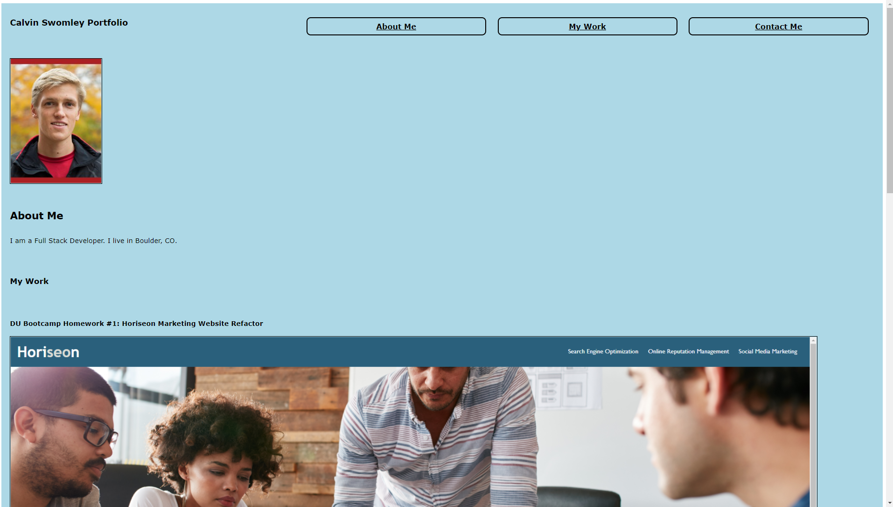
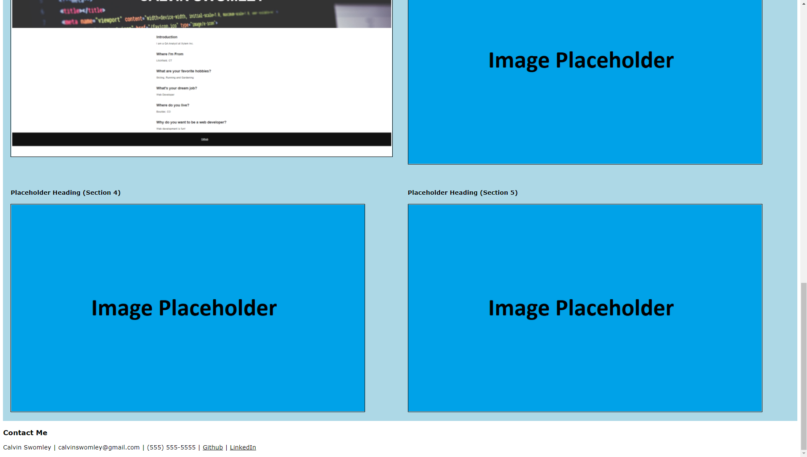

# Homework2-Calvin-Swomley-Portfolio
Homework 2: Advanced CSS a Calvin Swomley Portfolio. Due 9-8-2021.

Description:
This website is a portfolio of Calvin Swomley's web development work. The work included on this website will provide potential employers with the information they need to assess Calvin as a position candidate. The website has a responsive layout that utilizes CSS features such as flex boxes and media queries.

Completed Portfolio Screenshoot:

Link to Deployed Application: https://calvinswomley.github.io/Homework2-Calvin-Swomley-Portfolio/

